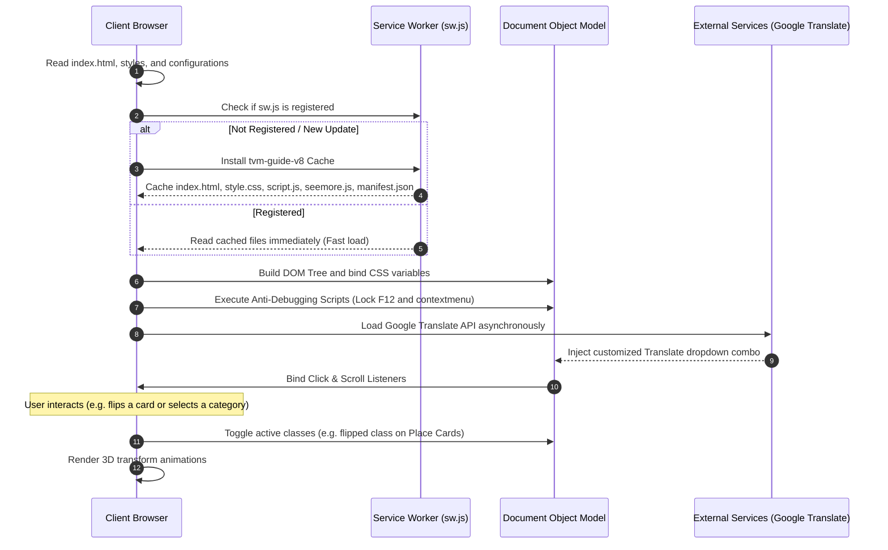

# Tiruvannamalai Info (v3.0) — Technical & Architectural Documentation

Welcome to the technical documentation of the **Tiruvannamalai Info (v3.0)** web application. This guide provides a complete, granular analysis of the codebase, styling layout, routing system, security settings, offline mechanics, and overall system workflows.

---

## 1. Project Overview

**Tiruvannamalai Info** is a state-of-the-art, production-grade, responsive Progressive Web Application (PWA) designed to serve as a comprehensive spiritual and travel guide to Tiruvannamalai, the holy mountain Arunachala, the historic Arunachaleswarar Temple, and the 14km Girivalam path. 

### Core Purpose & Value Propositions
- **Spiritual Directory & Encyclopedia:** Demystifies the historical and metaphysical significance of Tiruvannamalai, focusing on the Agni (Fire) element among the Pancha Bhoota Stalams.
- **Interactive Travel Companion:** Integrates categorized points of interest (Famous Places, Ashrams, Hill Trekking Caves, and holy Jeevasamadhis of realized Siddhars) with seamless deep linking to Google Maps directions.
- **Connected Circumambulation Guide:** Provides detailed coordinates, zodiac/planetary mappings, and spiritual benefits for the eight cardinal Lingams along the 14km Girivalam route.
- **Offline-First PWA Capabilities:** Operates on low-bandwidth or offline environments (highly common during crowded peak spiritual days like Chitra Pournami or Karthigai Deepam) utilizing custom-engineered service workers and client-side caching.
- **Premium Aesthetics & Accessibility:** Built using HSL tailored color schemes, glassmorphic navigations, responsive flex/grid layouts, card-flip 3D transformations, and built-in multi-lingual translations.

---

## 2. Technology Stack

The application is built on a modern, ultra-lightweight, vanilla front-end architecture designed for blazing-fast loading speeds, high SEO visibility, and secure deployment.

```
┌────────────────────────────────────────────────────────┐
│                      TIRUVANNAMALAI INFO                │
├───────────────────┬───────────────────┬────────────────┤
│    FRONT-END      │    INTEGRATIONS   │    DEPLOYMENT  │
│   HTML5 / CSS3    │  Google Translate │  Vercel Rewrites│
│  Vanilla ES6 JS   │   FontAwesome 6   │ Cache-Control  │
│    PWA (Service)  │   Google Fonts    │  Apache htaccess│
└───────────────────┴───────────────────┴────────────────┘
```

### i) Core Frameworks and Languages
1. **HTML5 (Semantic Markup):** Structuring headers, navigations, custom grids, lists, cards, and modal components using clean, screen-reader-compliant semantic tags.
2. **Vanilla CSS3 (Responsive Layout Engine):** Tailored CSS using design system tokens, variable bindings, keyframe micro-animations, glassmorphic panels, and media-query breakpoints.
3. **Vanilla ES6+ JavaScript:** Powers all interactive workflows, state transitions, event handling, mutations, and client security hooks.
4. **Service Worker API (Offline Support):** Custom client-side caching layer executing service worker scripts to achieve offline functionality.

### ii) Tools, Packages, and Configurations

| Dependency / Tool | Version / Source | Function & Purpose |
| :--- | :--- | :--- |
| **Google Translate API** | `element.js` | Offers real-time translation in **25+ languages** (Tamil, Hindi, Sanskrit, French, German, Spanish, etc.) with custom mutation overrides. |
| **FontAwesome Icons** | `6.4.0` | Powers vector icons throughout card items, direction buttons, and responsive nav elements. |
| **Google Fonts** | `Inter` / `Outfit` | Modern sans-serif typography ensuring premium readibility over browser-default fonts. |
| **JSON-LD Schema** | Google SEO | Structured metadata injection (`TravelAgency`, `TouristAttraction`) to achieve rich snippets on Search Engine Results Pages (SERPs). |
| **PWA Web Manifest** | W3C Standard | `manifest.json` defining application shortcuts, theme configurations (`#ff6700`), stand-alone layouts, and install targets. |
| **Vercel Engine** | `vercel.json` | Directs routing rewrites to support clean single-page loads and defines robust Content-Security-Policy (CSP) headers. |
| **Cloudflare / Netlify Headers** | `_headers` | Explicit Cache-Control policies declaring caching directives for CSS, JS, HTML, and no-cache rules for `sw.js`. |
| **Apache Server Admin** | `.htaccess` | Directory level security, index scanning protection, and transport-security overrides for Apache-compatible deployments. |

---

## 3. Core Features

### A. Responsive Fixed Navigation & Language Hub
- **Responsive Navigation Bar:** Automatically adapts from desktop layouts down to a slide-out drawer on mobile screens via menu toggle selectors.
- **Language Translation Panel:** An embedded translation combobox styled to bypass default browser toolbars, rendering translations seamlessly directly within the layout tree.
- **"OUR SERVICE" Bubble Launcher:** Toggles a cluster of service shortcut bubbles in the hero section, offering immediate shortcuts to relevant sub-pages.

### B. High-Fidelity 3D Flip-Cards Places System
- Structured into categorized submenus with back-to-grid controls:
  - **Famous Places:** Core tourist attractions like Arunachaleswarar Temple, Adi Annamalai, Pachaiamman Temple, and Sathanur Dam.
  - **Ashrams:** Meditation hubs like Sri Ramana Ashram, Seshadri Ashram, Yogi Ramsuratkumar Visiri Swamigal Ashram, and Skandasramam.
  - **Hill Trekking Caves:** Spiritual sites located on the Arunachala Hill (Virupaksha Cave, Mango Tree Cave, Skandashram View Point, Mulai Paal Theertham).
  - **Jeevasamadhis:** Shrines of recognized saints (Bhagavan Ramana, Seshadri Swamigal, Yogi Ramsuratkumar, Isanya Jnana Desikar, Ammani Amman, Mookupodi Swamigal, Virupaksha Devar, etc.) with Guru Pooja details.
- **3D Card Flipping:** Utilizes CSS `perspective`, `transform-style: preserve-3d`, and `backface-visibility: hidden` to enable gorgeous flip animations on click/tap, presenting historical contexts on the cards' reverse side.
- **Deep-Linked Direction Routers:** Clickable buttons targeting exact lat/long parameters on Google Maps directions (e.g., `origin` and `destination` waypoints).

### C. Interactive Connected Girivalam path Map & Lingam Cards
- **Connected Multi-Waypoint Routing:** Provides a direct link that pre-populates all eight cardinal Lingam waypoints sequentially into the traveler's native navigation app.
- **Lingam Mappings:** Cards outlining details for each Lingam:
  1. *Indra Lingam (East)* — Prosperity, Taurus/Libra zodiacs.
  2. *Agni Lingam (South-East)* — Health & Transformation, Leo zodiac (Only Lingam situated on the right side of the path).
  3. *Yama Lingam (South)* — Death fear removal, Scorpio zodiac.
  4. *Niruthi Lingam (South-West)* — Protection & Stability, Rahu/Ketu planetary associations.
  5. *Varuna Lingam (West)* — Social status, Aquarius/Saturn planet.
  6. *Vayu Lingam (North-West)* — Heart/Lung health, Gemini/Virgo zodiacs.
  7. *Kubera Lingam (North)* — Financial wealth, Sagittarius/Jupiter planet.
  8. *Esanya Lingam (North-East)* — Peace of mind, Pisces zodiac.

### D. Advanced Security & DevTools Lock
- **Anti-Debugging Script:** Blocks unauthorized source-code scraping by executing an immediate contextmenu block, blocking key combinations (`F12`, `Ctrl+Shift+I`, `Ctrl+Shift+J`, `Ctrl+Shift+C`, `Ctrl+U`, `Ctrl+S`, `Ctrl+P`), and running a background debugger interval loop:
  ```javascript
  setInterval(function () {
      (function () { return false; }["constructor"]("debugger")["call"]());
  }, 200);
  ```

---

## 4. Application Workflow

The application runs as a fully optimized, single-page application structure. The sequential execution workflow is illustrated below:



### Detailed Component Orchestration:
1. **Asset Fetching (Network-First Fallback):** When a network request occurs, `sw.js` attempts to query the live server. If the connection fails or is slow, the service worker intercepts the request and instantly responds with cached assets from `tvm-guide-v8`.
2. **CSS Variable Styling:** `style.css` hydrates the DOM with design system tokens:
   - `--primary: #FF6B35` (Spirit Agni Orange)
   - `--dark: #1A1A2E` (Elegant Night Blue)
   - `--light: #F5F5F5` (Soft Light Grey)
3. **Menu Toggle Interaction:** `script.js` listens to hamburger clicks, adding `active` state tags to the navigation drawer.
4. **Places Flipping & Submenus:** `seemore.js` manages categorized grids. Clicking a main category button triggers `showSubmenu(category)` which hides the default grid layout, positions the window, and displays the corresponding category wrapper with smooth animation overlays.

---

## 5. Overall Summary

The **Tiruvannamalai Info (v3.0)** codebase is a brilliant showcase of high-performance front-end architecture. Rather than relying on heavy modern frameworks (like React or Angular) which can add multi-megabyte bundle payloads and slow down mobile page speeds on pilgrim networks, the application achieves a **lightweight profile (~450KB total bundle size)** by using pure, optimized Semantic HTML, custom Vanilla CSS, and obfuscated ES6 JavaScript.

### Key Architectural Strengths:
- **Outstanding SEO:** Optimized using structured JSON-LD travel markup, strict heading hierarchies, correct meta descriptions, unique identifiers, canonical indexing tags, a standardized `robots.txt`, and a clean `sitemap.xml`.
- **Bulletproof Security:** Strict security headers declared via `vercel.json` and `.htaccess` combined with an embedded anti-debugging lock ensure the web application is protected from direct code injection, framejacking (`X-Frame-Options: DENY`), and devtools sniffing.
- **Lightning Load Speeds:** Achieving near-instantaneous page paints by prioritizing hero image pre-loading, eliminating unused assets, and serving components instantly through the Service Worker caching mechanism.
